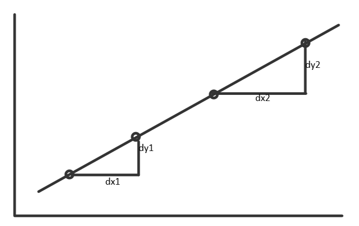

# WEEK03学习笔记
### 基础知识
#### 递归
1. 递归本质是循环。循环体在其内部调用自身函数进行循环执行。
2. 理解“归去来兮”的感觉。
	1. 向下进入下一层，向上返回原来的一层。
	2. 发生变化的是函数参数，但每一层构建的环境不变。
3. 递归代码模板
```python
# Pythondef recursion(level, param1, param2, ...):     
	# recursion terminator    
	#递归终止条件，没有这个会陷入死循环 
	if level > MAX_LEVEL: 	   
		process_result 	   
		return     
	# process logic in current level  
	#解决业务逻辑代码   
	process(level, data...)     
	# drill down    
	#递归调用自身 
	self.recursion(level + 1, p1, ...)     
	# reverse the current level status if needed
	#根据需要清理全局变量或其他因素状态
```
4. 思维要点
	1. 最大误区，使用人肉递归。
	2. 找最近最简有效方法，将其拆解成可重复解决的问题，即重复子问题。
	3. [数学归纳法的思维][1]
#### 分治与回溯
1. 分治与回溯的本质是递归，仍然是找解决问题的重复性。
2. 分治，是将将需要待解决的一个大问题化解为更细粒度的重复性的小问题，同时分别求解，再将求得的解组合起来返回为大问题的解。
3. 分治代码模板
```python
def divide_conquer(problem, param1, param2, ...): 
	# recursion terminator
	if problem is None:
	    print_result
	return
  	# prepare data
	data = prepare_data(problem)
	subproblems = split_problem(problem, data)
	# conquer subproblems
	subresult1 = self.divide_conquer(subproblems[0], p1, ...)
	subresult2 = self.divide_conquer(subproblems[1], p1, ...)
	subresult3 = self.divide_conquer(subproblems[2], p1, ...)
	#...
	# process and generate the final result
	result = process_result(subresult1, subresult2, subresult3, ...)
  	# revert the current level states
```
4. 回溯，采用试错的思想，尝试分步解决一个问题。在分步过程中，当发现可能现有的分步答案不能得到有效的正确解时，可能返回上一步或上几步，重新尝试用其他分步再次寻找有效解。
5. 回溯通常用递归实现，时间复杂度可能到指数级复杂度，在重复寻求答案过程后可能存在：
	1. 有一个有效的答案
	2. 没有求得任何解
6. 回溯代码模板和之前的范型递归代码模板类似。

### 本周leetcode练习总结
#### 94.二叉树的中序遍历（本周复习）
1. 递归法
	1. 根据中序遍历：左-\>根-\>右
	2. 调整相应的代码顺序即可得前序和后序
	3. 时间复杂度：O(n)，n取决于二叉树的深度
```python
# Definition for a binary tree node.
# class TreeNode:
#     def __init__(self, val=0, left=None, right=None):
#         self.val = val
#         self.left = left
#         self.right = right
class Solution:
    def inorderTraversal(self, root: TreeNode) -> List[int]:
        if root is None: return []
        return self.inorderTraversal(root.left) + [root.val] + self.inorderTraversal(root.right)
```

#### 258.各位相加（本周复习）
1. 迭代
	1. 如果num小于10，那么返回num
	2. 如果num大于等于10，将num通过map方法数组化，然后循环相加，直到最终的各位之和小于10，并返回。
	3. 时间复杂度：O(n)，n取决于num数字的长度及循环几次
```python
class Solution:
    def addDigits(self, num: int) -> int:
        while num>=10:
            digits = list(map(int,str(num)))
            num = 0
            for i in range(len(digits)):
                num += digits[i]
        return num
```

2. 数学推导
	1. 通过“任意数为9的倍数时，其位数最终和必为0”的规律
	2. 时间复杂度：O(1)
```python
class Solution:
    def addDigits(self, num: int) -> int:
        if (num%9==0) and (num!=0):
            return 9
        else:
            return num%9
```

#### 22.括号生成
1. 深度优先搜索（dfs）
	1. 左右括号可以使用的个数\>0，才继续生成（）
	2. 当左括号使用个数\>0时，可以生成（
	3. 当右括号使用个数\>0，且右括号剩余个数\>左括号使用个数时，才添加）
	4. 当左右括号使用个数都为0时，将结果添加到返回里
	5. 复杂度分析
		1. 时间复杂度：O(2n)
```python
class Solution:
    def generateParenthesis(self, n: int) -> List[str]:
        res=[]
        cur_str=''
        def dfs(cur_str,left,right):
            if left==0 and right==0:    #left,right==0时，添加结果
                return res.append(cur_str)
            if right<left:  #right<left，不符合返回空
                return
            if left>0:
                dfs(cur_str+'(',left-1,right)   #添加（，左-1
            if right>0:
                dfs(cur_str+')',left,right-1)   #添加），右-1
        
        dfs(cur_str,n,n)
        return res
```

#### 剑指 Offer 05. 替换空格
1. 迭代法
	1. for循环遍历字符串s，当遇到空字符串时，‘%20’进行替换，否则将s[i]添加到结果里，遍历完后返回结果
	2. 复杂度分析
		1. 时间复杂度：O(n)，n为字符串长度
		2. 空间复杂度：O(n)，需要额外空间保存结果
```python
class Solution:
    def replaceSpace(self, s: str) -> str:
        res = ""
        for i ,v in enumerate(s):
            if v ==" ":
                res+='%20'
            else:
                res+=s[i]
        return res
```

#### 21.合并两个有序链表（本周复习）
1. 递归法
	1. 如果l1为空或L2为空，则返回l2或l1
	2. 如果l1.val\<l2.val，l1.next= mergeTwoLists(l1.next,l2)，返回l1
	3. 反之亦然，当l1.val\>l2.val，l2.next= mergeTwoLists(l1,l2.next)，返回l2
	4. 复杂度分析
		1. 时间复杂度：O(m+n)，m,n分别为l1,l2
		2. 空间复杂度：O(m+n)，需要l1,l2的空间之和保存结果
```python
# Definition for singly-linked list.
# class ListNode:
#     def __init__(self, val=0, next=None):
#         self.val = val
#         self.next = next
class Solution:
    def mergeTwoLists(self, l1: ListNode, l2: ListNode) -> ListNode:
        if l1 is None:
            return l2
        elif l2 is None:
            return l1
        elif l1.val<l2.val:
            l1.next = self.mergeTwoLists(l1.next,l2)
            return l1
        else:
            l2.next = self.mergeTwoLists(l1,l2.next)
            return l2  
```

2. 迭代解法
	1. 创建一个空链表prev
	2. 当l1和l2不为空时：当l1.val\<l2.val时，prev.next=l1，l1=l1.next；反之亦然
	3. 当l1或l2为空时，prev.next指向剩余的一方，并返回prev.next
	4. 复杂度分析
		1. 时间复杂度：O(m+n)，需要遍历l1和l2
		2. 空间复杂度：O(m+n)，需要额外空间保存
```python
# Definition for singly-linked list.
# class ListNode:
#     def __init__(self, val=0, next=None):
#         self.val = val
#         self.next = next
class Solution:
    def mergeTwoLists(self, l1: ListNode, l2: ListNode) -> ListNode:
        
        prehead=ListNode(0) 
        prev=prehead    #哨兵节点
        while l1 and l2:    #l1和l2都存在时
            if l1.val<l2.val:
                prev.next=l1    #prev指向l1,l1移动一步
                l1=l1.next
            else:
                prev.next=l2
                l2=l2.next
            prev=prev.next
        #当其中一方没有后，链接剩余一方
        prev.next = l1 if l1 is not None else l2

        return prehead.next
```

#### 236.二叉树的最近公共祖先
最近公共祖先定义：若root为节点p,q的某公共祖先，且其左节点root.left和右节点root.right都不是p,q的公共祖先，则root为p,q的最近公共祖先。
1. p和q在root的子树中，且分列在root的异侧（即分别在左右子树中）。
	2. p=root，且q在root的左或右子树中
	3. q=root，且p在root的左或右子树中
通过递归对二叉树的后序遍历，遇到节点q或p时返回。当q或p在root的异侧时，节点root为最近公共祖先，向上返回root。
1. 递归法
	1. 终止条件
		1. 越过叶子节点，返回null
		2. 当root==p或q时，返回root
	2. 递归工作
		1. 递归左子树，返回left
		2. 递归右子树，返回right
	3. 根据left和right的返回值判断
		1. 当left和right均为空，说root的左右子树中不含p,q，返回null
		2. 当left和right均不为空，说明p,q在root的异侧，返回root
		3. 当left为空，right不为空，说明p,q不在root的左子树中，返回right，其中
			1. 若p或q其中一方在右子树中，right指向p或q，并返回
			2. 若p和q都在右子树中，right指向p和q的最近公共祖先
		4. 当left不为空，right为空，说明p和q不再root的右子树中，返回left即可，其中原理原来参考第3点。
	4. 复杂度分析
		1. 时间复杂度：O(n)，n为二叉树所有节点，可能遍历所有节点
		2. 空间复杂度：O(n)，递归深度可能为n，需要额外空间
```python
# Definition for a binary tree node.
# class TreeNode:
#     def __init__(self, x):
#         self.val = x
#         self.left = None
#         self.right = None

class Solution:
    def lowestCommonAncestor(self, root: 'TreeNode', p: 'TreeNode', q: 'TreeNode') -> 'TreeNode':
        if not root or p==root or q==root: return root
        left = self.lowestCommonAncestor(root.left,p,q)
        right = self.lowestCommonAncestor(root.right,p,q)
        if not left and not right: return   #1
        if not left: return right   #3
        if not right: return left   #4
        return root #2
```

#### 剑指 Offer 06. 从尾到头打印链表
1. 递归法
	1. 递推阶段：每次传入head.next，当head==null，返回[]作为终止条件
	2. 回溯阶段：利用python语言特性，回溯时每次返回当前list+当前节点head.val，即可实现倒序输出
	3. 复杂度分析
		1. 时间复杂度：O(n)，根据链表长度遍历n次
		2. 空间复杂度：O(n)，需要额外空间保存结果
```python
# Definition for singly-linked list.
# class ListNode:
#     def __init__(self, x):
#         self.val = x
#         self.next = None

class Solution:
    def reversePrint(self, head: ListNode) -> List[int]:
        return self.reversePrint(head.next) + [head.val] if head else []
```

2. 利用栈
	1. 栈的特性：先进后出。利用该特性，遍历链表，将每个元素压入栈，再取出，返回结果，即是倒序的结果。
	2. 复杂度分析
		1. 时间复杂度：O(n)，根据链表长度，入栈和出栈都是n
		2. 空间复杂度：O(n)，额外空间保存n长度的数组
```python
class Solution:
    def reversePrint(self, head: ListNode) -> List[int]:
        stack = []	#栈
        while head:
            stack.append(head.val)	#入栈
            head=head.next
        return stack[::-1]	#出栈
```

#### 226.翻转二叉树
1. 递归法（dfs）
	1. 利用递归，从根节点开始对树进行遍历，遇到叶子节点时翻转。
	2. 当root节点左右子树都已经完成翻转，交换两棵子树的位置，即完成整个树的翻转。
	3. 复杂度分析
		1. 时间复杂度：O(n)，n取决于树的节点个数
		2. 空间复杂度：O(logn)，取决于树的高度，最差情况下，树为链表，则为O(n)
```python
# Definition for a binary tree node.
# class TreeNode:
#     def __init__(self, x):
#         self.val = x
#         self.left = None
#         self.right = None

class Solution:
    def invertTree(self, root: TreeNode) -> TreeNode:
        if not root:        #终止条件
            return root
        #当前逻辑与下钻
        left = self.invertTree(root.left)   
        right = self.invertTree(root.right) 
        root.left , root.right = right , left
        return root
```

2. 广度优先搜索（bfs）
	1. 利用队列queue，初始将root压入队列
	2. 如果队列存在，弹出队列的头部元素，将头部元素的左右子节点位置互换。互换后将有效的子节点压入队列，进行下次迭代。
	3. 当整个迭代完毕，返回根节点root
	4. 复杂度分析：
		1. 时间复杂度：O(n)，遍历树的所有节点个数n。
		2. 空间复杂度：O(n)，需要额外空间队列保存元素
	5. 国际版代码（most votes）
```python
from collections import deque    
    
class Solution:
    def invertTree(self, root: TreeNode) -> TreeNode:        
        
        traversal_queue = deque([root]) if root else None
        
		# lanuch BFS, aka level-order-traversal to carry out invertion
        while traversal_queue:
            
            cur_node = traversal_queue.popleft()
            
			# Invert child node of current node
            cur_node.left, cur_node.right = cur_node.right, cur_node.left
            
			# push left child into queue to invert left subtree
            if cur_node.left:
                traversal_queue.append( cur_node.left )
            
			# push right child into queue to invert right subtree
            if cur_node.right:
                traversal_queue.append( cur_node.right )                
        
        return root
```
6. 国际版思路练习
```python
class Solution:
    def invertTree(self, root: TreeNode) -> TreeNode:
        from collections import deque
        queue = deque()
        if root:
            queue.append(root)
        else:
            return root
        while queue:
            cur_node = queue.popleft()
            cur_node.left ,cur_node.right = cur_node.right, cur_node.left
            if cur_node.left:
                queue.append(cur_node.left)
            if cur_node.right:
                queue.append(cur_node.right)
        return root
```

#### 剑指 Offer 68 - II. 二叉树的最近公共祖先（与236题相同）
1. 递归法
	1. 终止条件：a.当root为空，返回空；b.当p或q，其中之一==root，则返回root
	2. 递归工作：a.递归左子树，返回left；b.递归右子树，返回right
	3. 返回值判断
		1. 当left和right均为空，说明root的子树中不含p和q，返回null
		2. 当left和right均不为空，说明q和p在root的异侧，返回root
		3. 当left为空，right不为空时，返回right，其中：a.如果p或q其中一方在右子树中，返回right指向的p或q；b.如果p和q都在右子树中，则返回p和q的最近公共祖先
		4. 当left不为空，right为空时，返回left，其中原理与3点相同。
		5. 复杂度分析
			1. 时间复杂度：O(n)，n可能为树的所有节点个数
			2. 空间复杂度：O(n)，n为递归深度
```python
class Solution:
    def lowestCommonAncestor(self, root: 'TreeNode', p: 'TreeNode', q: 'TreeNode') -> 'TreeNode':
        if root is None or root==p or root==q:
            return root
        left = self.lowestCommonAncestor(root.left,p,q)
        right = self.lowestCommonAncestor(root.right,p,q)
        if not left: 
            return right
        if not right : 
            return left
        if left and right:
            return root
```

#### 24.两两交换链表中的节点（本周复习）
1. 递归法
	1. 终止条件：没有节点或只有一个节点，无法交换，直接返回
	2. 递归推倒：head表示原始链表的头节点，newhead表示新链表的头节点；a. 令newhead=head.next ；b. head.next= swapPairs(newhead.next)，表示所有节点进行两两交换；c.最后令newhead.next=head，完成所有交换；最后返回newhead.next
	3. 复杂度分析
		1. 时间复杂度：O(n)，n为链表的节点数
		2. 空间复杂度：O(n)，n为链表的节点数，递归需要用的栈空间
```python
# Definition for singly-linked list.
# class ListNode:
#     def __init__(self, val=0, next=None):
#         self.val = val
#         self.next = next
class Solution:
    def swapPairs(self, head: ListNode) -> ListNode:
        if not head or not head.next:
            return head
        newhead=head.next
        head.next=self.swapPairs(newhead.next)
        newhead.next=head
        return newhead
```

2. 迭代法
	1. 创建哨兵节点dummyhead，和temp表示当前节点，令dummyhead.next=head，temp=dummyhead
	2. temp后面如果没有节点或只有一个节点，则结束交换。否则获得temp后面的node1和node2，利用指针两两交换。temp-\>node1-\>node2 变为temp-\>node2-\>node1，再令temp=node1，循环至所有节点全部两两交换。
	3. 最终返回dummyhead.next
	4. 复杂度分析
		1. 时间复杂度：O(n)，n为链表长度，需要遍历所有节点
		2. 空间复杂度：O(1)，不需要额外空间
```python
class Solution:
    def swapPairs(self, head: ListNode) -> ListNode:

        #迭代
        dummyhead=ListNode(0)
        dummyhead.next=head
        temp=dummyhead
        while temp.next and temp.next.next:
            #初始node1 node2
            node1 , node2 = temp.next, temp.next.next
            #两两交换节点
            temp.next = node2   
            node1.next = node2.next
            node2.next = node1
            temp = node1
        return dummyhead.next
```

#### 26.删除排序数组中的重复项（本周复习）
1. 迭代法
	1. 创建指针j作为下标0
	2. 遍历排序数组，当num[i]!=num[j]时，j+1，且把num[j]=num[i]，直到数组遍历完
	3. 最终返回j+1
	4. 复杂度分析
		1. 时间复杂度：O(n)，n为数组长度
		2. 空间复杂度：O(1)
```python
class Solution:
    def removeDuplicates(self, nums: List[int]) -> int:
        j=0
        if len(nums)==0:
            return 0
        
        for i in range(1,len(nums)):
            if nums[i]!=nums[j]:
                j+=1
                nums[j]=nums[i]
        return j+1
```

2. 迭代法（2）
	1. 创建指针index，遍历数组nums。
	2. 当nums[index]==nums[index-1]时，弹出nums[index]；如果不相等index+1。（利用排序数组已排序的特性，遇到相同元素就弹出下一个）
	3. 返回剩余数组的长度
	4. 复杂度分析，与上述迭代法一致
```python
class Solution:
    def removeDuplicates(self, nums: List[int]) -> int:
        index = 1 
        while index < len(nums):
            if nums[index]==nums[index-1]:
                nums.pop(index)
            else:
                index+=1
        return len(nums)
```

#### 98.验证二叉搜索树
1. 递归法。定义一个递归函数帮助判断，helper(node,lower,upper)。
	1. 判断左子树，调用helper(root.left,lower,root.val)，如果当前节点node.val\<=lower 或\>=upper，则不满足二叉搜索树特性，返回false
	2. 同理判断右子树，调用helper(root.right,root.val,upper)。
	3. 如果root为空，空树是合法的二叉搜索树，返回true
	4. 复杂度分析
		1. 时间复杂度：O(n)，n为二叉树的节点树
		2. 空间复杂度：O(n)，n为递归时系统调用的栈空间，最差情况，树为链表。
```python
# Definition for a binary tree node.
# class TreeNode:
#     def __init__(self, val=0, left=None, right=None):
#         self.val = val
#         self.left = left
#         self.right = right
class Solution:
    def isValidBST(self, root: TreeNode) -> bool:
        def helper(node,lower=float('-inf'),upper=float('inf')):
            #terminator
            if not node:
                return True
            
            #current logic 
            if node.val <= lower or node.val >= upper:
                return False
            
            #drill down
            if not helper(node.left,lower,node.val):
                return False
            if not helper(node.right,node.val,upper):
                return False
            
            return True

        return helper(root)
```

2. 中序遍历
	1. 利用二叉搜树的特性，中序遍历（左\>-根-\>右）返回的数组为生序数组的特点，如果不是生序数组，则返回false，否则true。
	2. 利用栈先入后出的特点，遍历得到的节点值\<=inorder时，说明不是二叉搜索树
	3. 复杂度分析
		1. 时间复杂度：O(n) ，n为二叉树的节点个数
		2. 空间复杂度：O(n)，栈保存的二叉树节点个数
```python
# class TreeNode:
#     def __init__(self, val=0, left=None, right=None):
#         self.val = val
#         self.left = left
#         self.right = right
class Solution:
    def isValidBST(self, root: TreeNode) -> bool:
        stack =[]
        inorder = float('-inf')

        while stack or root:
            while root:
                stack.append(root)
                root=root.left
            node = stack.pop()
            if node.val<=inorder:
                return False
            inorder=node.val
            root=node.right
        
        return True
```

#### 1.两数之和（本周复习）
1. 字典法
	1. 创建一个字典用于保存遍历过的元素，如果target-下标i的元素的结果在字典中可以找到，返回字典元素的下标和i即可；否则将下标i的元素存入字典。
	2. 复杂度分析
		1. 时间复杂度：O(n)，n为数组长度
		2. 空间复杂度：O(n)，利用额外空间保存已遍历的元素
```python
class Solution:
    def twoSum(self, nums: List[int], target: int) -> List[int]:
        hashmap=dict()
        res=[]
        for i ,v in enumerate(nums):
            if hashmap.get((target - v)) is not None:
                res.append(hashmap.get(target - v))
                res.append(i)
            hashmap[v]=i
        return res
```

#### 49.字母异位词分组（本周复习）
1. 字典法（排序）
	1. 创建一个哈希表，利用字母异位词的特点：即字母相同、但顺序不同。则有排序后的异位词具有相同key的特点，在字典里将一组异位词保存在同一个key，并返回即可。
	2. 复杂度分析
		1. 时间复杂度：O(nlogn)，考虑两点：异位词的个数，与每个异位词的长度
		2. 空间复杂度：O(n)，需要额外空间保存，异位词个数\*每个异位词长度
```python
class Solution:
    def groupAnagrams(self, strs: List[str]) -> List[List[str]]:
        from collections import defaultdict
        mp=defaultdict(list)
        for st in strs:
            key = "".join(sorted(st))
            mp[key].append(st)
        return list(mp.values())
```

#### 111.二叉树的最小深度
1. 深度优先搜索（dfs）
	1. 遍历整个树，记录最小深度。具体表现，对于每个非叶子节点，通过递归方法计算其左右子树的最小深度，并返回树的最小深度。
	2. 复杂度分析
		1. 时间复杂度：O(n)，树的每个节点都要访问一次。
		2. 空间复杂度：O(logn)，平均情况树的高度与节点对数正相关，最差情况，树为链表，为O(n)。
```python
# Definition for a binary tree node.
# class TreeNode:
#     def __init__(self, val=0, left=None, right=None):
#         self.val = val
#         self.left = left
#         self.right = right
class Solution:
    def minDepth(self, root: TreeNode) -> int:
        #终止条件
        if not root:    #空节点
            return 0
        if not root.left and not root.right:    #节点为叶子节点
            return 1
        #下钻 & 当前逻辑
        min_dept=float('inf')   #无穷大
        if root.left:
            min_dept = min(self.minDepth(root.left),min_dept)
        if root.right:
            min_dept = min(self.minDepth(root.right),min_dept)
        
        return min_dept+1
```

2. 广度优先搜索（bfs）
	1. 利用队列，遍历树的每层节点，当遇到第一个叶子节点时，即树的最小深度。
	2. 当节点左子树不为空，将左子节点放入队列尾端，且深度+1；同理，当右子树不为空时，同样处理。
	3. 复杂度分析
		1. 时间复杂度：O(n)，n为树的节点个数，最多遍历所有节点。
		2. 空间复杂度：O(n)，取决于队列所需，最多保存树的所有节点。
```python
# Definition for a binary tree node.
# class TreeNode:
#     def __init__(self, val=0, left=None, right=None):
#         self.val = val
#         self.left = left
#         self.right = right
class Solution:
    def minDepth(self, root: TreeNode) -> int:
        if not root: 
            return 0

        from collections import  deque
        queue = deque()
        queue.append([root,1])

        while  queue:
            node , depth = queue.popleft()
            if not node.left and not node.right:
                return depth
            if node.left:
                queue.append([node.left,depth+1])
            if node.right:
                queue.append([node.right,depth+1])
        
        return 0
```

#### 15.三数之和
1. 排序+双指针
	1. 要求找到不重复且和为0的三元组，不重复需要满足以下两点：
		1. 第二重遍历的元素不小于第一重的元素
		2. 第三重遍历的元素不小于第二重的元素
	2. 即枚举到的三元组（a,b,c），当满足a\<=b\<=c时，就会过滤掉（b,a,c）或（c,b,a）之类的重复组合。所以首先要对数组进行排序，使其成为生序数组。
	3. 要求a+b+c=0，同等于a+b=-c，如此第二重循环和第三重循环可以并列进行。第二重循环时，a的下标sec从左往右，b的下标thd从右往左，依次寻找a+b=-c的解。
	4. 当fir\<sec\<thd，且a+b=-c（c的下标fir）成立时，将（fir,sec,thd）三元组放入返回列表中。当不满足该条件时，即给定数组中没有满足题目要求的解。
	5. 复杂度分析
		1. 时间复杂度：O(n^2)，需要对数组n进行两次循环
		2. 空间复杂度：O(n)，对输入数组重新排序需要数组长度的空间
```python
class Solution:
    def threeSum(self, nums: List[int]) -> List[List[int]]:
        n = len(nums)
        res = []
        nums.sort()
        #一重循环
        for fir in range(n):
            #和上次的fir元素相同时继续寻找下一个元素
            if fir>0 and nums[fir]==nums[fir-1]:
                continue
            target = -nums[fir]
            thd = n-1 #下标thd从右往左
            for sec in range(fir+1,n):
                #和上次的sec元素相同时继续寻找下一个
                if sec>(fir+1) and nums[sec]==nums[sec-1]:
                    continue
                
                #当sec+thd<>target时，移动thd
                while sec<thd and nums[sec]+nums[thd]>target:
                    thd-=1
                
                #当符合sec+thd<=target时判断sec和thd
                #当sec和thd相等时，即后续没有sec+thd=-fir，且sec<thd的解
                if sec==thd:
                    break   

                if nums[sec]+nums[thd]==target:
                    res.append([nums[fir],nums[sec],nums[thd]])

        return res
```

2. 双指针+排序（2）
	1. 将数组进行排序，分别给予k,i,j三个指针。
	2. k在外层循环，也在数组的左边，从左往右移动；i、j在内循环，i从k+1处，右左往右移动，j从len(nums)-1开始，由右往左移动；要保持i\<j。
	3. 当nums[k]+nums[i]+nums[j]=0时，添加进结果，并移动i+=1，j-=1：a.当nums[i]==nums[i-1]时，再次移动i，避免重复元素；b.当nums[j]==nums[j+1]时，再次移动j，避免重复元素。
	4. 当nums[k]+nums[i]+nums[j]\<0时，表示i太小，需要移动i；反之，当nums[k]+nums[i]+nums[j]\>0时，表示j太大，需要移动j。
	5. 复杂度分析
		1. 时间复杂度：O(n^2)，需要遍历2次长度为N的数组。
		2. 空间复杂度：O(1)，指针使用常数大小的空间
```python
class Solution:
    def threeSum(self, nums: List[int]) -> List[List[int]]:
        n = len(nums)
        nums.sort()
        res=[]

        for k in range(n-2):  
            if nums[k]>0:
                return res  
            if k>0 and nums[k]==nums[k-1]:  #跳过重复元素
                continue
            i , j = k+1, n-1
            while (i<j):
                if nums[k]+nums[i]+nums[j]==0:  #符合条件，添加结果
                    res.append([nums[k],nums[i],nums[j]])
                    i+=1
                    j-=1
                    while i<j and nums[i]==nums[i-1]:   #跳过重复元素
                        i+=1
                    while i<j and nums[j]==nums[j+1]:   #跳过重复元素
                        j-=1
                elif nums[k]+nums[i]+nums[j]<0: #i元素太小，移动i
                    i+=1
                    while i<j and nums[i]==nums[i-1]:
                        i+=1
                else: 
                    j-=1    #j元素太大，移动j
                    while i<j and nums[j]==nums[j+1]:
                        j-=1
        
        return res
```

#### 105.从前序与中序遍历序列构造二叉树
1. 递归法
	1. 根据前序（根-\>左-\>右）与中序（左-\>根-\>右）的遍历顺序确定根节点在中序遍历中的位置。
	2. 根据根节点位置，将序列中的左子树和右子树确定出来；根据这个方法不断递归推导，直至所有节点的左右子节点都确认完毕，最终返回root。
	3. 复杂度分析
		1. 时间复杂度：O(n)，n为二叉树的所有节点数
		2. 空间复杂度：O(n)，递归时系统用的栈空间
```python
# Definition for a binary tree node.
# class TreeNode:
#     def __init__(self, x):
#         self.val = x
#         self.left = None
#         self.right = None

class Solution:
    def buildTree(self, preorder: List[int], inorder: List[int]) -> TreeNode:
		#没有左右子树时终止
        if not preorder and not inorder:
            return
        
        root = TreeNode(preorder[0])
        idx = inorder.index(preorder[0])
		#传入左子树
        root.left = self.buildTree(preorder[1:idx+1],inorder[:idx])
		#传入右子树
        root.right = self.buildTree(preorder[idx+1:],inorder[idx+1:])

        return root
```

#### 77.组合
1. 回溯法
	1. 回溯：以[1,2,3,4]，k=2为例，当有[1,2]后，因为数组长度==k，所以把2去掉，再继续生成[1,3]，以此类推。
	2. 什么时候返回当前递归结果？当len(cur\_res)==k时，就把当前结果append进返回结果。
	3. 什么时候回溯？当cur\_res长度不满足k时进行。
	4. 回溯时所需参数：
		1. cur\_res，第二步判断所需内容
		2. 下次访问的元素下标index，如已访问[1,2]，下次回溯时要访问3，则传index+1
	5. 复杂度分析
		1. 时间复杂度：O(n)，n为数组长度
		2. 空间复杂度：O(n)，n为系统递归时调用的栈
```python
class Solution:
    def combine(self, n: int, k: int) -> List[List[int]]:
        #生成数组
        nums = [i for i in range(1,n+1)]
        # print(nums)
        res=[]

        def backtrace(cur_res,idx):
            # print("cur_res:",cur_res)
            if len(cur_res)==k:
                res.append(cur_res[:]) 
                return
            
            for i in range(idx,n+1):
                cur_res.append(i)
                backtrace(cur_res,i+1)
                cur_res.pop()
            
        if n==0 or k==0:
            return res
        
        backtrace([],1)
        return res
```

打印输出：
   cur\_res: []
' +
  'cur\_res: [1][2]
' +
  'cur\_res: [1, 2]	--add&return
' +
  'cur\_res: [1, 3]	--add&return
' +					
  'cur\_res: [1, 4]	--add&return
' +
  'cur\_res: [2][3]
' +
  'cur\_res: [2, 3]	--add&return
' +
  'cur\_res: [2, 4]	--add&return
' +
  'cur\_res: [3][4]
' +
  'cur\_res: [3, 4]	--add&return
' +
  'cur\_res: [4]

2. 深度优先搜索（dfs）+回溯（国际版题解学习）
	1. n,k作为全局变量，应该可以不传入gen\_comb函数
```python
class Solution:
    def combine(self, n: int, k: int) -> List[List[int]]:
        result = []  
        def gen_comb(n, k, start, cur_comb):
            if k == len(cur_comb):
                # base case, also known as stop condition        
                result.append( cur_comb[::] )
                return
            else:
                # general case:
                # solve in DFS
                for i in range(start, n+1):  
                    cur_comb.append( i )         
                    gen_comb(n, k, i+1, cur_comb)     
                    cur_comb.pop()    
                return
        # ----------------------------------------------
        gen_comb( n, k, start=1, cur_comb=[] )
        return result
```

#### 46.全排列
1. 递归回溯法[^1]
	1. 深度优先搜索中需要nums,size,depth,path,res几个变量，其中nums表示数组，size表示数组长度，depth表示递归到几层，path是个栈变量，res用于保存结果
	2. 除根节点和叶子节点外，每个节点都需要做递归工作：在选择一些数的情况下，在剩下未选择的数字里，依次选择一个数字。
	3. 递归终止条件：一个排列中的数字已经选择够了。需要用depth表示当前递归到第几层。
	4. 布尔数组used，初始化为false，当选择了某个数字，就将其在数组的位置置为true；当用过后，下次再用之前将其置回false，这里时O(1)的时间复杂度，以空间换时间的策略。
	5. path用于保存中间结果，也用于配合used对数字状态的翻转
	6. 复杂度分析
		1. 时间复杂度：O(n\*n!)
		2. 空间复杂度：O(n\*n!)
```python
class Solution:
    def permute(self, nums: List[int]) -> List[List[int]]:
        def dsf(nums,size,depth,path,used,res):
            #终止条件
            if depth==size:
                res.append(path[:]) #deep copy
                return
            #当前逻辑a
            for i in range(size):
                if not used[i]:
                    used[i]=True    
                    path.append(nums[i])
                    #递归调用
                    dsf(nums,size,depth+1,path,used,res)
                    #状态翻转
                    used[i]=False   #回复元素i的使用状态
                    path.pop()  #撤销元素i

        size=len(nums)
        res=[]
        used = [False for i in range(size)]

        #特殊情况返回
        if size==0:
            return res
        
        dsf(nums,size,0,[],used,res)
        return res
```

#### 66.加一（本周复习）
1. 递归法
	1. 当末尾元素\<=8时，末尾元素加1，并返回
	2. 当只有一个元素，且为9时，返回[1,0]
	3. 当末尾元素=0时，进行递归，返回递归结果
	4. 复杂度分析
		1. 时间复杂度：O(n)，n为数组长度
		2. 空间复杂度：O(1)
```python
class Solution:
    def plusOne(self, digits: List[int]) -> List[int]:
        if digits[-1]<9:
            digits[-1]+=1
            return digits
        elif len(digits)==1 and digits[0]==9:
            return [1,0]
        else:
            digits[-1]=0
            digits[0:-1]=self.plusOne(digits[0:-1])
            return digits
```

2. pythonic风格
	1. 利用内置函数将数组数字化，加一后再数组化，最后返回。
	2. 复杂度分析
		1. 时间复杂度：O(n)
		2. 空间复杂度：O(1)
```python
class Solution:
    def plusOne(self, digits: List[int]) -> List[int]:
        r = list(map(int,str(int("".join(map(str, digits)))+1)))
        # print(r)
        return [0]*(len(digits)-len(r)) + r
```

#### 面试题 17.09. 第 k 个数
1. 动态规划
	1. 解题思路
		1. 起始素数是1，3，5，7；基础因子为3，5，7
		2. 后续素数也是由3，5，7这三个数相互相乘结合得出。即后续素数都可以最终分解成3、5、7.
		3. 假设num3、num5、num7分别为3、5、7，需要判断从答案队列中取第几位数进行相乘。如（3，5，7）是1分别乘以3，5，7的结果；（9，15，21）是3乘以3，5，7的结果；以此类推。
		4. 后续素数规律：每次要新增的素数，即答案队列中下一位数n，分别乘以因子3，5，7后，从得到的三个数中取最小的添加进答案队列。
	2. 推导可知
		1. 假设num3、num5、num7初始为1，代表答案队列的第几个元素下标。后续用该元素分别相乘3，5，7，取三个值中的最小值作为答案队列的新增元素，同时将相应的下标+1。
		2. k\<=4时，直接返回答案。
	3. 复杂度分析
		1. 时间复杂度：O(n)，n=k，要迭代至第k个元素，返回操作是O(1)
		2. 空间复杂度：O(n)，要保存k个元素的空间
```python
class Solution:
    def getKthMagicNumber(self, k: int) -> int:
        #初始化
        num3=num5=num7=1
        numlist=[1,3,5,7]
        #当K<=4时
        if k<=4:
            return numlist[k-1]
        
        #求解第k个数
        for i in range(4,k):
            val = min(numlist[num3]*3 , numlist[num5]*5 , numlist[num7]*7)
            numlist.append(val)
            if numlist[num3]*3==val:
                num3+=1
            if numlist[num5]*5==val:
                num5+=1
            if numlist[num7]*7==val:
                num7+=1
        
        return numlist[k-1]
```

#### 47.全排列II
1. 递归回溯法
	1. 在46.全排列的基础上，增加了序列中元素可重复，但返回结果中不能存在重复。那需要在可能产生重复结果的地方进行剪枝处理。
	2. 为了剪枝方便，提前对序列做排序。一旦发现某个分支搜索下去的地方可能搜到到某个重复元素，就停止搜索，这样避免了结果中的重复。
		![][image-1]
	3. 搜索的数和上次一样，但在回溯中刚刚被撤销，在下一次递归中还可以被使用，所以会产生重复，所以需要被剪枝。（增加代码如下）
```python
if i > 0 and nums[i] == nums[i - 1] and not used[i - 1]:
        continue
```
4. 复杂度分析（和46.全排列一样）
	1. 时间复杂度：O(n\*n!)
		2. 空间复杂度：O(n\*n!)
```python
class Solution:
    def permuteUnique(self, nums: List[int]) -> List[List[int]]:
        def dsf(nums,size,depth,path,used,res):
            #终止条件
            if depth==size:
                res.append(path[:]) #deep copy
                return
            #当前逻辑
            for i in range(size):
                if not used[i]:
                    if i >0 and nums[i]==nums[i-1] and not used[i-1]:
                        continue
                    used[i]=True    
                    path.append(nums[i])
                    #递归调用
                    dsf(nums,size,depth+1,path,used,res)
                    #状态翻转
                    used[i]=False   #回复元素i的使用状态
                    path.pop()  #撤销元素i

        nums.sort()
        size=len(nums)
        res=[]
        used = [False for i in range(size)]

        #特殊情况返回
        if size==0:
            return res
        
        dsf(nums,size,0,[],used,res)
        return res
```
5. 46和47两道全排列题解参考：
	1. 46.全排列：[https://leetcode-cn.com/problems/permutations/solution/hui-su-suan-fa-python-dai-ma-java-dai-ma-by-liweiw/][5]
		2. 47.全排列2:[https://leetcode-cn.com/problems/permutations-ii/solution/hui-su-suan-fa-python-dai-ma-java-dai-ma-by-liwe-2/][6]

#### 70.爬楼梯
1. 递归
	1. 根据每次一级台阶和二级台阶的特点，得知f(n)=f(n-1)+f(n-2)的公式
	2. 递归工作，调用函数自身，传入n-1和n-2参数，返回两者之和。需要注意的是当N很大时，可能超时，可以通过LRU缓存解决。
	3. 复杂度分析：
		1. 时间复杂度：O(n)
		2. 空间复杂度：O(n)
```python
class Solution:
    @functools.lru_cache(1000)  #缓存装饰器
    def climbStairs(self, n: int) -> int:
        #终止条件+处理逻辑
        if n ==1 or n ==2:
            return n
        # 递归调用
        return self.climbStairs(n-1) + self.climbStairs(n-2)
```

2. 迭代
	1.   将1,2保存为变量
	2. 从3～n+1迭代，中间结果tmp=a+b，最后返回循环到n的结果
	3. 复杂度分析
		1. 时间复杂度：O(n)
		2. 空间复杂度：O(1)，没有利用额外空间
```python
class Solution:
    def climbStairs(self, n: int) -> int:
        #处理n<=2时
        if n ==1 or n ==2:
            return n
        #初始化变量
        a , b , tmp = 1, 2 ,0
        for i in range(3,n+1):
            tmp=a+b #f(n) = f(n-1) + f(n-2)
            a=b
            b=tmp
        return tmp
```

#### 1232.缀点成线
1. 等比叉乘法
	![][image-2]
	1. 线上任意一对点，在x轴方向上的增量与y轴方向上的增量具有等比例的性质
	2. 如图所示dx1/dy1=dx2/dy2 ， 可变换为dx1\*dy2 = dx2\*dy1，规避分母为0的问题
	3. 复杂度分析
		1. 时间复杂度：O(n)，n为数组长度
		2. 空间复杂度：O(1) 
```python
class Solution:
    def checkStraightLine(self, coordinates: List[List[int]]) -> bool:
        x0 ,y0 = coordinates[0]
        x1 ,y1 = coordinates[1]
        dx , dy = x1-x0 , y1-y0	#x,y的等比例增量
        for i in range(len(coordinates)):
            temp_dx = coordinates[i][0] - x0
            temp_dy = coordinates[i][1] - y0
            if temp_dx * dy != temp_dy * dx:
                return False
        return True
```

[^1]:	需要多做题和多理解

[1]:	https://baike.baidu.com/item/%E6%95%B0%E5%AD%A6%E5%BD%92%E7%BA%B3%E6%B3%95/5155524?fr=aladdin
[2]:	https://baike.baidu.com/item/%E6%95%B0%E5%AD%A6%E5%BD%92%E7%BA%B3%E6%B3%95/5155524?fr=aladdin
[3]:	https://leetcode-cn.com/problems/permutations/solution/hui-su-suan-fa-python-dai-ma-java-dai-ma-by-liweiw/
[4]:	https://leetcode-cn.com/problems/permutations-ii/solution/hui-su-suan-fa-python-dai-ma-java-dai-ma-by-liwe-2/
[5]:	https://leetcode-cn.com/problems/permutations/solution/hui-su-suan-fa-python-dai-ma-java-dai-ma-by-liweiw/
[6]:	https://leetcode-cn.com/problems/permutations-ii/solution/hui-su-suan-fa-python-dai-ma-java-dai-ma-by-liwe-2/

[image-1]:	
[image-2]:	